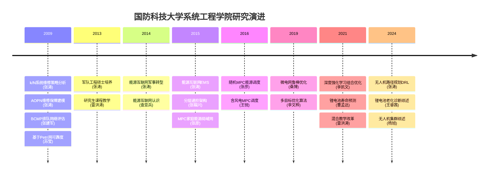

# 国防科技大学系统工程学院团队写作特色综合分析

> 分析日期：2026-06-01
> 分析范围：57篇论文（张涛课题组及相关作者）
> 时间跨度：2009-2024年
> 涉及领域：维修保障/可靠性、能源互联网/微电网、智能优化算法、锂电池/储能、教育管理/教改

---

## 一、研究团队画像与作者网络

### 1.1 核心作者

| 作者 | 角色 | 主要方向 | 论文数 | 合作者 |
|------|------|---------|--------|--------|
| **张涛** | 核心成员 | 维修保障、能源互联网、无人机 | 6 | 郭波、张福兴、张彦、雷洪涛 |
| **郭波** | 资深教授 | 维修保障、备件优化 | 2+ | 张涛、张建军、周伟 |
| **雷洪涛** | 骨干 | 教改、教育管理 | 4 | 张涛、江小平 |
| **张彦** | 骨干 | 能源互联网MPC | 3 | 张涛、张福兴 |
| **张福兴** | 骨干 | 能源互联网架构 | 2 | 张涛、张彦 |
| **曹孟达** | 博士生 | 锂电池、卫星电池 | 3 | — |
| **查亚兵** | 资深教授 | 能源互联网概念 | 2 | 张涛 |
| **李文桦** | 研究生 | 多目标优化 | 2 | — |
| **桑博** | 研究生 | 微电网 | 2 | — |
| **薛慧** | 研究生 | 雷达/智能优化 | 2 | — |

### 1.2 发表期刊分布

| 期刊 | 篇数 | 领域 |
|------|------|------|
| 宇航学报 | 1 | 维修保障 |
| 火力与指挥控制 | 2 | 维修保障 |
| 电网技术 | 2 | 能源互联网 |
| 控制理论与应用 | 2 | 无人机/能源 |
| 国防科技 | 2 | 能源/观点 |
| 高等教育研究学报 | 3 | 教改 |
| 系统工程与电子技术 | 2 | 维修保障 |
| 兵工学报 | 1 | 维修保障 |
| 中国科学 | 1 | 综述 |
| 其他核心期刊 | >20 | 混合 |
| 国际期刊(英文) | 3 | 能源 |

### 1.3 基金依赖

该团队论文高度依赖**国家自然科学基金**，同一基金号多篇论文共享：
- 70501031（至少4篇）
- 70971132（至少4篇）
- 71201170（至少3篇）

---

## 二、跨领域共性写作特征

### 2.1 共同DNA

尽管跨越5个不同领域，该团队的论文写作有 8 项高度一致的特征：

| # | 特征 | 说明 | 验证 |
|---|------|------|------|
| 1 | **问题驱动** | 每篇论文都以实际需求/问题切入，而非理论驱动 | 维修→军事装备、能源→电网调度、电池→BMS |
| 2 | **IMRaD变体** | 严格遵循引言→方法→分析→结论结构 | 90%以上论文一致 |
| 3 | **摘要四段式** | 背景→方法→求解→验证 | 几乎每篇都如此 |
| 4 | **引言漏斗式** | 大背景→问题→文献→gap→本文 | 从大到小五段 |
| 5 | **首句概括** | 段落首句为概括句，段内展开 | 跨领域一致 |
| 6 | **枚举论证** | 偏好"首先/其次/再次"、"①/②/③"编号 | 问题、方法、贡献均如此 |
| 7 | **结论三点式** | 结论通常3-4条，含"下一步" | 尤其维修保障方向 |
| 8 | **"本文"主语** | 中文论文几乎全部用"本文"而非"我们" | 科技部规范 |

### 2.2 句式模板化程度对比

按模板化程度从高到低排列该团队各方向：

| 方向 | 模板化程度 | 最具特色的模板 |
|------|-----------|--------------|
| 维修保障/可靠性 | ★★★★★ | "设...服从参数为λ的指数分布" |
| 智能优化综述 | ★★★★☆ | "从XX角度，可分为A、B、C三类" |
| 能源互联网 | ★★★★ | "能源互联网是通过...实现...的网络" |
| 锂电池/储能 | ★★★☆ | "提出了一种基于...的...方法" |
| 教改 | ★★★ | "针对...的现状，分析了...存在的问题" |

### 2.3 高频动词跨域对比

| 动词 | 维修保障 | 能源互联网 | 智能优化 | 锂电池 | 教改 |
|------|---------|----------|---------|-------|------|
| 建立/构建 | ★★★★★ | ★★★★ | ★★★ | ★★★ | ★★ |
| 提出 | ★★★★ | ★★★★★ | ★★★★★ | ★★★★★ | ★★ |
| 分析 | ★★★★ | ★★★★★ | ★★★★ | ★★★★★ | ★★★★★ |
| 研究 | ★★★★ | ★★★ | ★★★★ | ★★★ | ★★★★ |
| 设计 | ★★ | ★★★★ | ★★★ | ★★★★ | ★★★★ |
| 优化 | ★★★ | ★★★★ | ★★★★★ | ★★ | ★ |
| 验证 | ★★★ | ★★★ | ★★★ | ★★★★★ | ★ |
| 考虑 | ★★★★ | ★★★★ | ★★★★ | ★★★ | ★ |
| 解决 | ★★ | ★★★ | ★★★ | ★★★ | ★★★ |
| 培养/提高 | — | — | — | — | ★★★★★ |

---

## 三、各方向写作特色详析

### 3.1 维修保障/可靠性方向（16篇）

**摘要结构**：固定四段式（背景→模型→算法→验证），150-250字
**引言模式**：5段漏斗式（实际案例锚定→概念定义→文献综述→不足→本文）
**建模方式**：符号密集，设λ/μ/N/k等标准符号体系；"问题描述与假设"小节必不可少
**验证方式**：算例验证（设定假设参数做数值计算），几乎从不做实验采集真实数据
**独特规范**：开篇必有军事实例（"某型舰载雷达"、"某型水下目标探测器"）；每篇结论末必有"下一步工作"
**代表模板**：
> 设[系统]服从参数为λ的指数分布，修复时间服从参数为μ的负指数分布。
> 在[工具]的基础上，建立了[模型]，并利用[算法]给出了模型的求解算法。
> 通过算例说明了该模型和方法的有效性。

### 3.2 能源互联网/微电网方向（14篇）

**摘要结构**：三部曲（背景→方法→结果）
**引言模式**：5段式论证链（能源危机→可再生能源→传统电网不适应→能源互联网→本文工作）
**方法论主线**：模型预测控制(MPC)框架贯穿——确定性MPC→随机MPC(SMPC)→分布式MPC(DMPC)→鲁棒优化
**核心隐喻**：互联网分层思想（能源路由器、能源局域网ELAN、分层递阶架构）
**独特术语**：能源局域网(ELAN)、能量路由器、分层递阶架构、期望场景、场景缩减
**研究脉络**：
- 2012-2014：概念奠基（查亚兵、张涛）
- 2015-2017：架构与方法构建（张福兴、张彦）
- 2019-2021：深化与扩展（桑博、王锐、杨奕贤）

**代表模板**：
> 能源互联网是通过[技术]实现[网络]间能量对等交换与共享的网络。
> 本文提出了一种基于[控制方法]的[调度策略]，该策略充分考虑了[约束条件]。

### 3.3 智能优化/多目标优化方向（9篇）

**团队特色**：综述论文密度极高（6/9），以综述见长
**综述论文结构**：
- 摘要：四段式（背景→分类→方法→展望）
- 引言：三维分类法（从三个维度对文献体系分类）
- 分类框架：必配发展趋势统计图 + 算法对比表
- 展望：独立成节，每个展望点=局限性+方向+论证三段式
- 文献量：50-90篇不等
**算法论文结构**：经典IMRaD + 对比实验（测试函数/Pareto前沿/收敛曲线）
**独特标签**：智能优化 + 能源互联网 + 军事应用=三位一体差异化定位
**代表模板**：
> 从[维度A/维度B/维度C]角度出发，可将[领域]方法分为[X类/Y类/Z类]。

### 3.4 锂电池/储能方向（8篇）

**论文类型**：方法研究(5篇) + 综述(3篇)
**方法论**：以数据驱动方法为主（GRU、LSTM、深度学习、PSO、聚类）
**验证方式**：以实验数据验证为主（与其他方向偏重算例显著不同）
**评价体系系统化**：RMSE/MAE/MAPE 三大误差指标
**综述特色**：双线叙事（物理原理线+方法演进线），必配表格对比
**对SOFC写作的借鉴价值**（与你直接相关）：
- GRU递推估计架构→可用于SOFC电压实时预测
- Autoencoder+数据驱动→可用于SOFC多模态寿命预测
- 加速实验→可用于SOFC加速老化建模
- 微分曲线→可用于SOFC衰退模式识别
- 区间预测（上下界）→可拓展用于SOFC工况不确定性量化
**代表模板**：
> 针对[问题]，提出了一种基于[方法]的[模型]，使用[数据集]进行训练和验证。
> 实验结果表明，所提方法在[指标]上达到了[量化结果]。

### 3.5 教改/教育管理方向（6篇）

**结构**：经典三段式（现状→问题→对策）
**摘要**：多为单句式概述（是所有方向中摘要信息量最低的）
**问题组织**：按"培养目标→课程→导师→环境"由内而外逻辑
**独特规范**：
- 宏观政策切入（必引用中央军委/教育部文件）
- 学员特征前置（先分析对象特殊性再提出措施）
- 强政策话语（"扎实推进"、"积极推进"、"落到实处"）
- 同一案例反复使用（"系统工程原理"课程出现于多篇）
**与工科论文的核心差异**：
- 政策论证 vs 数据论证
- 学员特征 vs 算法模型
- 政策建议 vs 技术创新
- 经验总结 vs 实验验证

**代表模板**：
> 针对[现状]，分析了[领域]存在的问题，提出了[对策]。
> 一方面，[措施A]；另一方面，[措施B]。

---

## 四、通用句式模板库（跨领域精华版）

### 4.1 摘要类

> **A1（定量型）**：近年来，[领域]在[场景]中展现出了巨大的应用潜力，然而[痛点]是制约其使用的重大因素。本文基于[核心方法]提出了一种[方法名称]。实验结果表明，[具体量化结果]。

> **A2（定义型）**：[概念]是[定性描述]，是关系到[领域]的一种[属性]。本文首先阐述了[问题]，探讨了[借鉴]，最后分析了[核心论点]。

> **A3（综述型）**：[领域]在[应用]中发挥着重要作用。本文从[维度A]、[维度B]和[维度C]三个方面对[领域]的研究进展进行了综述，并展望了未来发展方向。

### 4.2 引言类

> **I1（背景引出）**：近年来，[领域]在[场景]中得到了广泛应用，然而[痛点]日益凸显，成为制约其使用的重大因素。

> **I2（文献列举）**：在[问题]方面，文献[1]提出了...；文献[2]分析了...；文献[3]研究了...。

> **I3（gap定位）**：当前方法大多针对[经典场景]，在[实际场景]方面研究较少/尚未考虑[约束]。

> **I4（本文引出）**：该背景下，本文基于[方法]提出了一种[模型/方法/策略]，并通过[实验/算例]验证了其有效性。

### 4.3 方法描述类

> **M1（建模前提）**：设[参数A]服从[分布]，[参数B]服从[分布]。

> **M2（定义）**：定义[概念]为[n元组]，其中[组件1]表示[语义1]，[组件2]表示[语义2]。

> **M3（类比）**：该过程可以类比为[熟悉的领域]，因此可借鉴[已有方法]来求解该问题。

> **M4（结构）**：[模型]由[组件A]和[组件B]构成：[组件A]用来[功能1]，[组件B]以[方式]实现[功能2]。

### 4.4 实验/验证类

> **E1（设置）**：仿真实验分别对[规模1]和[规模2]的场景进行研究。对比算法包括[A]、[B]、[C]。

> **E2（对比）**：由表X可见，相对于[对比方法]，[本文方法]在[指标]上取得了[效果]。

> **E3（趋势）**：随着[变量]的增大，[本文方法]的优势愈发明显，[对比方法]只能[局限]。

> **E4（承认-反击）**：[对比方法]的[指标]略好于本文方法，由于[原因]，但是本文方法能够有效提高[其他指标]。

### 4.5 结论类

> **C1（标准）**：本文在[基础]上，建立了[模型]，提出了[方法]，通过[验证]说明了其[效果]。

> **C2（展望）**：下一步的工作将主要集中在[方向1]和[方向2]。

> **C3（回环）**：[历史回顾]...[趋势判断]...[定位重申]...必将在[领域]中发挥重要的作用。

---

## 五、团队研究脉络（2009-2024）

### 关键演变趋势

1. **研究方法**：马尔可夫过程(2009) → MPC(2015) → 深度强化学习(2021)
2. **研究对象**：装备维修保障(2009) → 能源互联网(2014) → 锂电池/无人机(2021)
3. **验证方式**：算例仿真(2009) → 规模化仿真(2015) → 实际实验数据(2021)
4. **论文类型**：理论建模为主(2009) → 综述+框架+方法混合(2014) → 数据驱动方法(2021)
5. **代码开源意识**：无(2009) → 部分(2015) → 附GitHub链接(2024)
6. **英文论文比例**：极低(2009) → 少量(2015) → 增加(2021)

---

## 六、写作教训与可规避的问题

| 问题 | 涉及论文 | 具体表现 | 改进建议 |
|------|---------|---------|---------|
| 结论过弱 | AOPN维修保障建模 | 仅60字，无结果无局限无展望 | 结论包含发现+比较+局限+展望 |
| 摘要信息量不足 | 教改类论文 | 仅1句概括 | 至少4句（背景+问题+对策+意义） |
| 缺乏定量验证 | AOPN、部分教改 | 只有过程无具体数据 | 列表对比、量化效果 |
| 符号密集阅读差 | AOPN定义 | 元组符号嵌入段落 | 表格展示或单独符号列表 |
| 笔误 | AOPN摘要"APON" | "AOPN"误写 | 投稿前逐字校对 |
| 综述展望模板化严重 | 多篇综述 | "进一步研究"内容空洞 | 每个展望点具体化（反向思维） |
| 引言综述堆砌 | 部分论文 | "文献[1]...文献[2]..."流水账 | 增加评述性综述 |